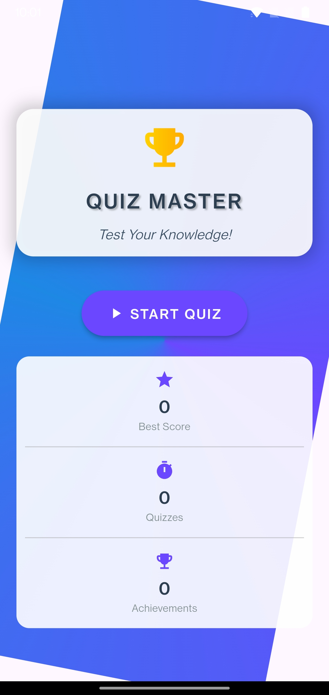
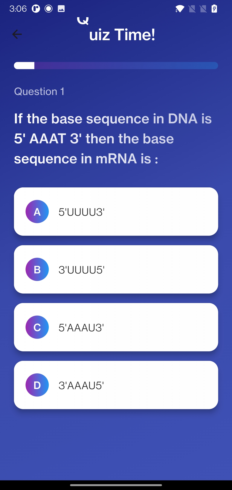
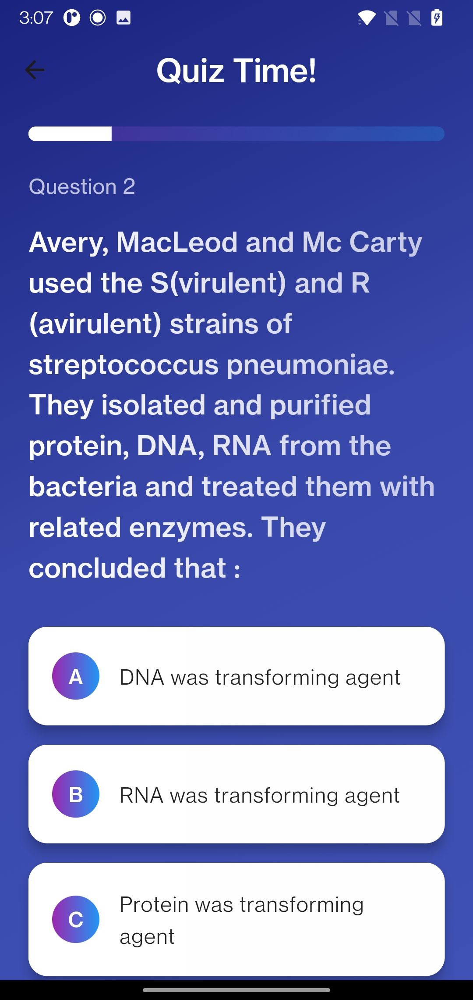
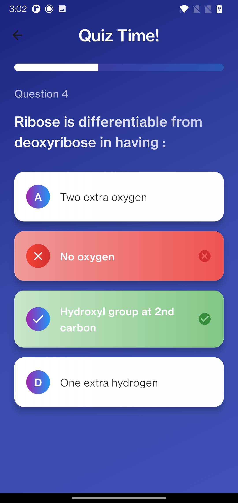
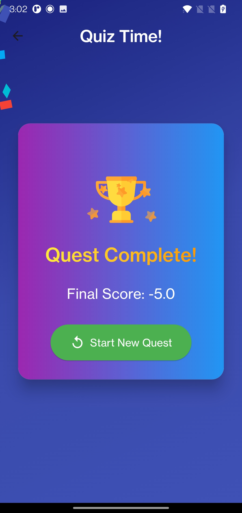
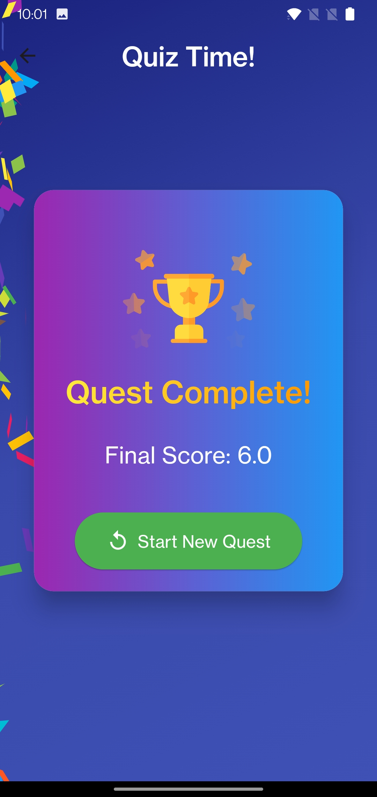

### GitHub README for Quiz Application

```markdown
# Quiz Application 🎮

A dynamic and interactive Flutter-based quiz application featuring gamification elements. This app fetches quiz data from an API and offers an intuitive user experience with real-time score updates, progress tracking, and comprehensive results. Perfect for learning, fun, and challenge!

## Features 🌟

- **Dynamic Quiz Data**: Fetches questions and options from a remote API.
- **Intuitive UI/UX**: Smooth navigation, appealing design, and responsive layout.
- **Progress Tracking**: See your progress and score updates in real-time.
- **Gamification**: Engage with the quiz through a user-friendly interface.
- **Detailed Results**: View detailed results and track your performance.

## Screenshots 📸

### Home Screen


### Question 1


### Question 2


### Right Answer Result


### Negative Result


### Final Results


## Demo Video 🎥

Experience the app in action! Click the link below to watch the demo video:
[Watch Demo](demo/demo.mp4)

## Installation 🚀

1. Clone the repository:
   ```bash
   git clone https://github.com/yourusername/quiz-app.git
   ```
2. Navigate to the project directory:
   ```bash
   cd quiz-app
   ```
3. Install dependencies:
   ```bash
   flutter pub get
   ```
4. Run the app:
   ```bash
   flutter run
   ```

## Usage 📖

1. Launch the app.
2. Select a quiz to start.
3. Answer the questions.
4. View your progress and final results.
5. Restart the quiz or select a new one to try again.

## Project Structure 🗂

- **models/**: Contains the data models for the quiz.
- **providers/**: Manages the state and logic of the quiz.
- **utils/**: Utility functions and API service for fetching quiz data.
- **screens/**: Different screens of the app (Home, Quiz, Result).

## Contributing 🤝

Contributions are welcome! Please fork the repository and submit a pull request for any improvements or bug fixes.

## License 📜

This project is licensed under the MIT License. See the `LICENSE` file for more details.

## Acknowledgements 🙌

- Thanks to [API Service] for providing the quiz data.
- Special mention to the Flutter community for their support and resources.

---

Happy Quizzing! 🧠
```

### Additional Notes:
- Replace `screenshots/home.png`, `screenshots/q1.png`, etc., with the actual paths to your screenshot files.
- Update `[Watch Demo](path-to-video)` with the actual path or link to your demo video.
- Update `https://github.com/yourusername/quiz-app.git` with the actual GitHub repository URL.
- If you have any special acknowledgments, add them in the "Acknowledgements" section.

This README provides a detailed overview of your project, highlights its features, and guides users through installation and usage, making it informative and engaging.
